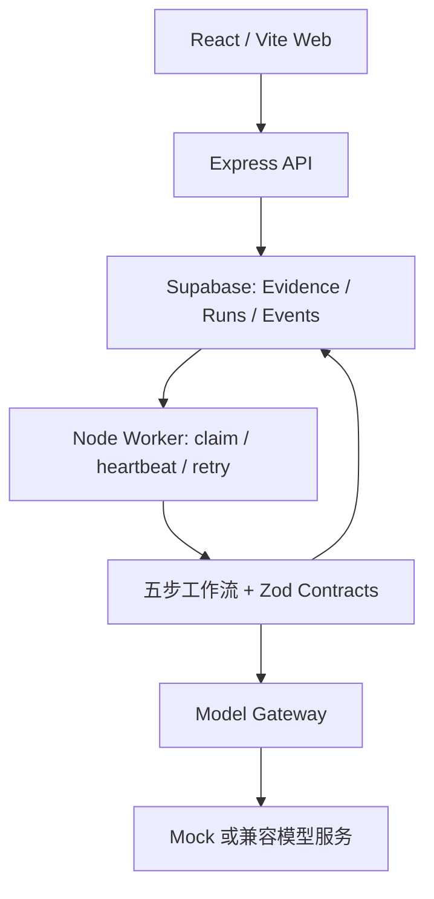

# AI Career Copilot

**An evidence-grounded workspace for job matching, interview preparation, and application drafts.**

把职位要求与个人经历证据连接起来，生成可追溯的差距诊断、准备计划和求职材料草稿。

[工程落地与掌握路线](docs/ENGINEERING_AND_MASTERY.md) · [最小私有演示部署](docs/DEPLOY.md) · [产品设计](AI-Career-Copilot.md)

求职准备的难点不只是生成流畅文字，而是判断“哪条经历支持哪项要求、哪些能力还缺证据”。本项目以 Evidence Vault 为输入边界，将 JD 分析保存为异步 Career Run，保留当时的证据快照与执行事件。

## 核心能力

- **Evidence Vault**：维护经历、技能和证明链接；区分草稿、用户确认、拒绝与过期状态，材料生成仅使用用户确认的证据。
- **Evidence-to-Result**：串联要求解析、证据匹配、差距诊断、准备计划和材料生成。
- **Traceable Runs**：异步任务保留独立证据快照与有序步骤事件；后续编辑 Evidence 不改变历史输入。
- **Background Execution**：API 与 Worker 解耦；幂等创建、任务领取、lease/heartbeat、过期回收与有限重试。
- **Structured Generation**：Model Gateway 提供超时、有限重试、JSON/Zod 校验与修复；支持 Mock 与 OpenAI-compatible 服务。

当前定位是 **Evidence-to-Result AI 应用工程原型**。执行器是显式五步顺序工作流，匹配使用关键词规则；检索增强与可中断 Agent 编排是后续演进方向。

## 用户流程与示例


示例：JD 要求 Python 和 Docker；用户有已确认的 Python 项目经历，Docker 经历仍是草稿。

| 输出 | 用户能看到什么 |
|---|---|
| Requirement Match | 岗位要求与对应经历的关联 |
| Gap Diagnosis | 哪些要求已有支持，哪些还缺证据或需要确认 |
| Preparation Plan | 围绕当前差距生成准备任务 |
| Application Draft | 基于已确认经历的可编辑草稿与 Evidence 引用 |
| Run Trace | 各步骤状态、摘要和失败信息 |

这是产品流程示例，不代表模型效果评测。匹配分数是“已匹配要求数 / 提取要求数”的百分比，confidence 是固定启发值，均不代表录用概率。

## 系统结构



Web、API、Worker 在本地运行，默认持久化连接 Supabase Cloud。`local-first` 描述应用运行方式，不表示数据完全保留在设备；真实模型请求会包含相关 JD 和 Evidence。

| 模块 | 责任 | 入口 |
|---|---|---|
| Web | Evidence 管理、JD 提交、结果与 Trace | [apps/web](apps/web) |
| API | 输入校验、Evidence CRUD、Run 创建与查询 | [apps/api](apps/api) |
| Worker | 领取任务、租约、工作流、重试 | [workflow.js](apps/worker/src/workflow.js) |
| Contracts | 共享输入、证据、分析结果与材料结构 | [contracts](packages/contracts/src/index.js) |
| Persistence | Evidence、Run 快照与事件；按用户查询 | [persistence](packages/persistence/src/index.js) |
| Model Gateway | 协议、超时、重试、JSON/Zod 校验 | [model-gateway](packages/model-gateway/src/index.js) |
| Migrations | 表、权限与队列 RPC | [supabase/migrations](supabase/migrations/) |

材料引用检查会拒绝不属于已确认 Evidence 的 ID；这证明引用合法，还不能证明每句话都被证据支持。语义支持检查是后续质量门槛。

## 核心工程要点

### Evidence 快照

创建 Run 时保存所选 Evidence 快照。此后修改或删除 Evidence，不会改写该 Run 的历史输入。

### 显式五步工作流

```text
analyze_requirements
→ match_candidate_evidence
→ diagnose_gaps
→ create_preparation_plan
→ create_artifact_draft
```

各步骤写入 started/completed/failed 事件。证据匹配由关键词规则完成；模型负责要求解析、差距诊断、计划和草稿。Mock 提供确定性输出，便于离线验证。

### 异步执行

API 返回任务标识，Worker 从数据库领取任务。幂等创建减少重复提交；lease/heartbeat 与过期回收支持中断后重试。当前重试以整个工作流为单位，步骤事件用于追踪，不是可恢复 checkpoint。

### Model Gateway

使用 OpenAI-compatible Chat Completions 协议：超时、有限 HTTP 重试、JSON 解析、Zod 校验与输出修复。真实模型错误进入失败处理，不会静默替换成 Mock 结果。

## 快速启动

主应用使用 Node.js 22 与仓库锁定的 pnpm（见 `packageManager`）。Python 环境用于后续实验，不是当前 Web 启动前提。在项目根目录运行：

```powershell
pnpm.cmd install --frozen-lockfile
pnpm.cmd check
pnpm.cmd test
pnpm.cmd --filter @copilot/web build
if (!(Test-Path .env)) { Copy-Item .env.example .env }
```

在自己的开发 Supabase 项目应用 [migrations](supabase/migrations/)，填写 `.env`：

```ini
SUPABASE_URL=https://your-project-ref.supabase.co
SUPABASE_SERVICE_ROLE_KEY=your-backend-secret
MODEL_PROVIDER=mock
```

完整字段见 [.env.example](.env.example)。已有 CLI 时可用（执行前用本机 `--help` 确认命令，并确认目标是开发项目）：

```powershell
supabase login
supabase link --project-ref <your-development-project-ref>
supabase db push
```

Secret/service role 凭据只放在后端环境，不能进入前端构建。然后启动：

```powershell
pnpm.cmd dev
```

打开 [Web](http://localhost:5173) 和 [API health](http://localhost:8787/health)。健康接口的 `persistence` 应为 `supabase`；`memory` 模式的 API 与独立 Worker 不共享队列，不能完成跨进程异步闭环。

演示验收：新建并确认 Evidence → 提交相关 JD → 查看 Run 状态和五步事件 → 核对草稿引用。无密钥的 `pnpm.cmd test` 只验证离线契约。

云端私有演示见 [docs/DEPLOY.md](docs/DEPLOY.md)。

## 接入真实模型

```ini
MODEL_PROVIDER=openai-compatible
MODEL_BASE_URL=https://your-provider.example/v1
MODEL_NAME=your-provider-model
MODEL_API_KEY=your-local-secret
```

也可使用代码内 `openai`、`deepseek`、`qwen`、`openrouter`、`ollama`、`vllm` preset。`.env.example` 已有 `MODEL_BASE_URL`，切换 preset 时应同步修改或移除它，否则会覆盖 preset 地址。

协议适配不等于每个服务商都通过实连验收。

## 验证与质量演进

| 层次 | 验证入口 | 验收产物 |
|---|---|---|
| 工程契约 | `check`、`test`、Web build | 可重复检查日志 |
| 应用闭环 | Web → API → Supabase → Worker → 结果 | 脱敏 Run、快照、事件与草稿 |
| 内容质量 | 人工核对要求与证据 | 固定用例、逐声明支持标注、错误分类 |
| 检索质量 | 当前规则基线；后续接入检索 | 冻结语料、标注、检索/重排配对报告 |

测试和构建证明工程行为；模型质量由固定样本与可审阅输出建立。演示匹配分数不作为模型评测结果。

## 当前边界与路线

- 身份仍来自 `x-demo-user-id`；生产分支只检查 Authorization 头是否存在，没有完成 token 验证。公开服务前需要真实身份校验与跨用户授权测试。
- Worker 重试会重新执行工作流；步骤事件不是可恢复的步骤 checkpoint。取消更新状态，但工作流尚未逐步检查取消或中止模型请求。
- Gateway 返回调用元数据，步骤事件主要保存摘要；完整 usage/latency、attempt 归属与预算追踪需要接通。
- PDF/DOCX、Embedding/Hybrid Retrieval/Reranker、完整 Auth UI、独立代码 Runner 属于后续能力；当前执行器未使用 LangGraph StateGraph。

优先推进：身份与证据可信边界 → Worker 所有权和取消 → 真实模型质量闭环 → 检索评测 → 有状态 Agent 编排。详见 [工程落地与掌握路线](docs/ENGINEERING_AND_MASTERY.md)。

## 仓库结构

```text
apps/web                 Web 工作台
apps/api                 Evidence / Career Run API
apps/worker              队列消费与五步工作流
packages/contracts       Zod 数据契约
packages/persistence     内存与 Supabase Repository
packages/model-gateway   Mock 与兼容模型适配
supabase/migrations      表、权限与队列 RPC
docs                     工程改进、学习路线与部署说明
```

项目展示重点是证据建模、异步可靠性、可审阅材料生成与全栈交付。设计文档中的完整目标通过分阶段验收进入实现。
