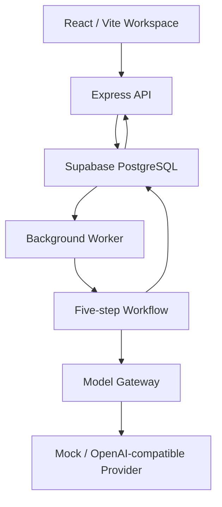

# AI Career Copilot

**An evidence-grounded workspace for job matching, interview preparation, and application drafts.**

从职位要求出发，连接个人经历证据，生成可追溯的差距诊断、准备计划与求职材料草稿。

[工作流实现](apps/worker/src/workflow.js) · [数据契约](packages/contracts/src/index.js) · [Model Gateway](packages/model-gateway/src/index.js)

求职准备需要把“做过什么”转化为“哪些经历能够支持这个岗位”。AI Career Copilot 以个人证据库为基础，让每一次 JD 分析保留输入快照、匹配依据与执行过程，方便用户检查和修改生成结果。

## Highlights

- **Evidence Vault**：集中维护项目经历、技能、证明链接与确认状态。
- **Evidence-to-Result**：串联要求解析、证据匹配、差距诊断、准备计划和材料生成。
- **Traceable Runs**：异步任务保留独立证据快照与有序步骤事件，历史结果对应当时的输入。
- **Background Execution**：API 与 Worker 解耦，提供任务领取、租约心跳、过期回收与有限重试。
- **Structured Generation**：统一模型入口、JSON/Zod 校验与有限修复，支持 Mock 和 OpenAI-compatible 服务。

## User Journey


### Example

一个岗位要求 Python 与 Docker 经验。用户的证据库包含已确认的 Python 项目，以及尚待确认的 Docker 实践记录。

| 输出 | 用户能看到什么 |
|---|---|
| Requirement Match | 岗位要求与对应经历的关联 |
| Gap Diagnosis | 哪些要求已有支持，哪些还缺证据或需要确认 |
| Preparation Plan | 围绕当前差距生成准备任务 |
| Application Draft | 基于已确认经历生成的可编辑草稿与 Evidence 引用 |
| Run Trace | 各步骤的执行状态、摘要和失败信息 |

这是产品流程示例。当前匹配采用关键词规则；匹配分数表示规则覆盖情况，不代表录用概率。

## Architecture



Web、API、Worker 在本地启动，默认数据存储连接 Supabase Cloud。真实模型启用后，所需 JD 与 Evidence 通过 Worker 发送到配置的模型服务。

| 模块 | 责任 |
|---|---|
| Web | Evidence 管理、JD 提交、结果与 Trace 展示 |
| API | 输入校验、Evidence CRUD、Run 创建与查询 |
| Worker | 领取任务、维护租约、执行工作流、处理重试 |
| Contracts | 共享输入、证据、分析结果与材料结构 |
| Persistence | Evidence、Run 快照与事件的持久化 |
| Model Gateway | 模型协议、超时、重试与结构化输出处理 |

## Core Engineering

### Evidence snapshots

创建 Run 时保存所选 Evidence 的快照。此后修改或删除 Evidence，不会改写该 Run 的历史输入，便于追踪结果来源和比较多次分析。

### Explicit workflow

工作流依次执行五个步骤：

```text
analyze_requirements
→ match_candidate_evidence
→ diagnose_gaps
→ create_preparation_plan
→ create_artifact_draft
```

各步骤写入 started/completed/failed 事件。当前实现采用显式顺序编排，证据匹配由规则完成；模型负责要求解析、差距诊断、计划和草稿生成。Mock 通过确定性输出支持开发和离线验证。

### Grounded drafts

材料生成只接收用户确认的 Evidence，并检查返回的引用 ID 是否属于确认集合。输出作为用户可审阅的草稿：引用合法性与逐句事实支持是不同层面的质量要求，后续将扩展声明级支持检查。

### Asynchronous runs

API 返回任务标识，Worker 从数据库领取任务。幂等创建减少重复提交，lease/heartbeat 与过期回收为中断后的重试提供基础。当前重试以整个工作流为单位，步骤事件用于追踪执行过程。

### Model Gateway

Gateway 使用 OpenAI-compatible Chat Completions 协议，提供超时、有限 HTTP 重试、JSON 解析、Zod 校验与输出修复。真实模型错误进入失败处理，不会静默替换成 Mock 结果。

## Quick Start

使用 Node.js 22 和仓库 `packageManager` 指定的 pnpm。在项目根目录执行：

```powershell
pnpm.cmd install --frozen-lockfile
if (!(Test-Path .env)) { Copy-Item .env.example .env }
```

在自己的开发 Supabase 项目中应用 [数据库迁移](supabase/migrations/)，配置 `.env`：

```ini
SUPABASE_URL=https://your-project-ref.supabase.co
SUPABASE_SERVICE_ROLE_KEY=your-backend-secret
MODEL_PROVIDER=mock
```

完整字段见 [.env.example](.env.example)。数据库密钥只提供给后端，不应进入前端代码或公开仓库。配置完成后启动：

```powershell
pnpm.cmd dev
```

打开 [Web 工作台](http://localhost:5173)；[API 健康接口](http://localhost:8787/health) 的 `persistence` 应为 `supabase`。内存模式用于进程内开发，不与独立 Worker 共享队列。

第一次体验：创建并确认 Evidence → 选择证据并提交 JD → 查看分析结果 → 检查材料引用与步骤事件。

### Use a model provider

```ini
MODEL_PROVIDER=openai-compatible
MODEL_BASE_URL=https://your-provider.example/v1
MODEL_NAME=your-model
MODEL_API_KEY=your-local-secret
```

代码提供 `openai`、`deepseek`、`qwen`、`openrouter`、`ollama`、`vllm` preset。显式 `MODEL_BASE_URL` 优先于 preset；切换服务时同步调整该字段。

## Evaluation Approach

项目将工程行为、内容质量与检索质量分别验证：

| 层次 | 关注点 | 入口 |
|---|---|---|
| Engineering | 数据契约、工作流行为、Gateway 错误处理 | 各 package 与 Worker 的测试 |
| Application | 快照、任务状态、事件和结果的一致性 | Web → API → Worker → 数据库闭环 |
| Grounding | 要求是否准确，声明是否有证据支持 | 固定 JD/Evidence 样本与人工审阅 |
| Retrieval | 相关证据的召回与排序 | 后续检索基线和配对评测 |

离线检查入口为 `pnpm.cmd check`、`pnpm.cmd test`；前端构建入口为 `pnpm.cmd --filter @copilot/web build`。内容质量以样本和可审阅输出为依据。

## Scope & Roadmap

当前版本面向本地开发与受控演示，使用 demo 身份；公开多人使用前需要完成真实认证与授权。应用采用顺序工作流和关键词匹配。

后续重点：

- 完善身份、证据归属和声明级支持校验。
- 增加 Worker attempt 所有权、步骤恢复与取消传播。
- 接通模型 usage、延迟与 Run 预算记录。
- 扩展文档解析、Embedding、混合检索与重排评测。
- 引入补问、人工确认与可恢复的 Agent 状态编排。

## Repository Layout

```text
apps/
├── web/                  React 工作台
├── api/                  Express API
└── worker/               后台执行与工作流
packages/
├── contracts/            Zod 共享契约
├── persistence/          Evidence / Run / Event 存储
└── model-gateway/        模型适配与结构化输出
supabase/migrations/      数据表与队列 RPC
```
